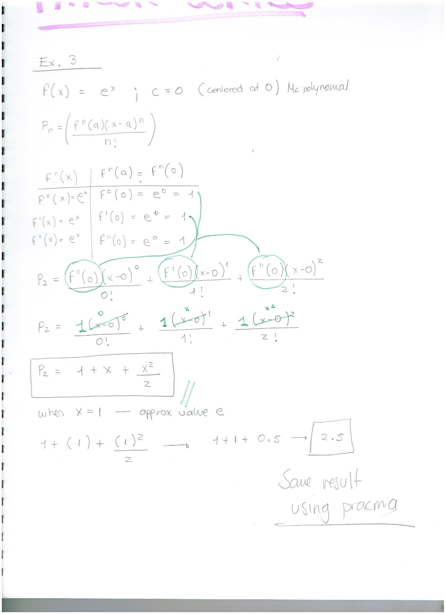

```{r setup, include=FALSE}
knitr::opts_chunk$set(echo = TRUE)
```

### Problem 

Key Idea 8.8.1 gives the $n^{th}$ term of the Taylor series of common functioons. 
In Exercises 3, verify the formula given in the Key Idea by finding the first few terms of the Taylor series of the given function and identifying a pattern.

$$f(x)=e^x; c=0$$
```{r taylor, warning=FALSE}
library(pracma)

x <- function(x) exp(x)

result <- taylor(x,0,2)

result

```

```{r}
sum(result)
```

```{r}
plot(x)
```


