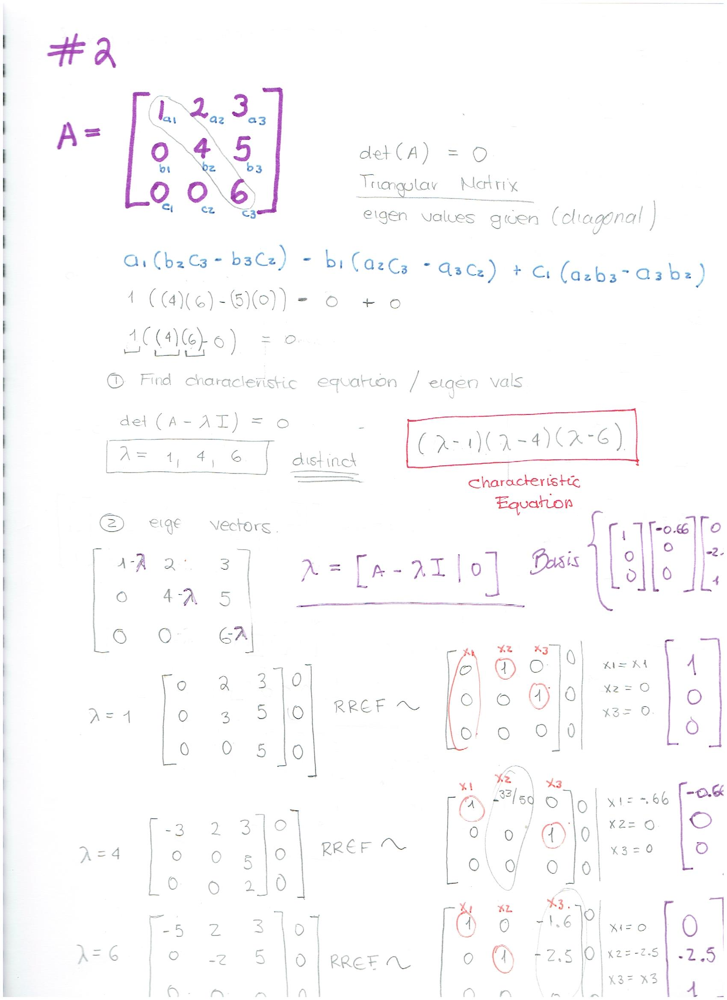

```{r setup, include=FALSE}
knitr::opts_chunk$set(echo = TRUE)
```

# Problem Set 1

### 1. What is the rank of the Matrix A?

$$
A = 
\begin{bmatrix}
    1 & 2 & 3 & 4 \\
    -1 & 0 & 1 & 3 \\
    0 & 1 & -2 & 1 \\
    5 & 4 & -2 & -3 \\
\end{bmatrix}
$$
```{r,results='asis', echo=FALSE}
A = matrix(c(1,-1,0,5,2,0,1,4,3,1,-2,-2,4,3,1,-3), nrow = 4, ncol = 4)

A

```
```{r,results='asis', echo=FALSE}
library(pracma)

Rank(A)
```

Matrix Rank is the # of nonzero rows in the row echelon form of the Matrix thus:

```{r, results='asis', echo=FALSE}
rref(A)

# the number of nonzero rows in the row echelon form is 4
```

### 2.- Given an mxn matrix where m > n, what can be the maximum rank? The minimum rank, assuming that the matrix is non-zero?

Maximum rank  = n
Minimum rank possible = 1 ( assuming non zero)

### 3 What is the rank of matrix B?

$$
B = 
\begin{bmatrix}
    1 & 2 & 1 \\
    3 & 6 & 3 \\
    2 & 4 & 2 \\
  
\end{bmatrix}
$$

```{r,results='asis', echo=FALSE}
B = matrix(c(1,3,2,2,6,4,1,3,2), nrow = 3, ncol = 3)

B
```
```{r rank of B, results='asis', echo=FALSE}
Rank(B)

# only one linearly independent
```
```{r rref of B, results='asis', echo=FALSE}

rref(B)
```

# Problem Set 2

### 1.- Compute the eigenvalues and eigenvectors of the matrix A. You’ll need to show your work. You’ll need to write out the characteristic polynomial and show your solution.

$$
C = 
\begin{bmatrix}
    1 & 2 & 3 \\
    0 & 4 & 5 \\
    0 & 0 & 6 \\
  
\end{bmatrix}
$$
```{r matrix c,results='asis', echo=FALSE}
C = matrix(c(1,2,3,0,4,5,0,0,6), nrow = 3, ncol = 3)

C
```

```{r row reduction, results='asis', echo=FALSE }
X1 = matrix(c(0,0,0,2,3,0,3,5,5), nrow = 3, ncol = 3)
X4 = matrix(c(-3,0,0,2,0,0,3,5,2), nrow = 3, ncol = 3)
X6 = matrix(c(-5,0,0,2,-2,0,3,5,0), nrow = 3, ncol = 3)

rref(X1)
rref(X6)
rref(X6)
```
$$

Basis = 
\begin{bmatrix}
    1\\
    0\\
    0\\
\end{bmatrix}

$$
$$
\begin{bmatrix}
    (-)0.66\\
    0\\
    0 \\
\end{bmatrix}
$$


