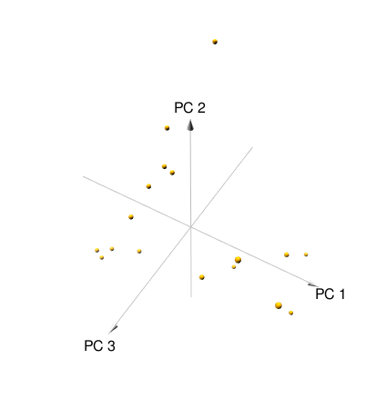

```{r setup, include=FALSE}
knitr::opts_chunk$set(echo = TRUE)
```

## Eigenshoes

Perform matrix transformations on images of shoes using Principal Component Analysis (PCA). Eigenvalues and eigenvectors will display images based on the calculated level of variance from the PCA. 

Build and visualize  eigenimagery that accounts for 80% of the variability


```{r jpeg, warning=FALSE, message=FALSE}

library(magick)

eigenshoes_data_matrix <- NULL

for (i in list.files(path = "~/R/DATA_605/GITHUB/DT_605/HWs/jpeg", full.names = T)) {
  eigenshoes_images <- image_read(i)
  eigenshoes_images_data <- as.numeric(eigenshoes_images[[1]][1, , ])
  eigenshoes_data_matrix <- rbind(eigenshoes_data_matrix, eigenshoes_images_data)
}
rownames(eigenshoes_data_matrix) <- list.files(path = "~/R/DATA_605/GITHUB/DT_605/HWs/jpeg" )


```

Principal Component Analysis PCA

```{r}
eigenshoes_data_matrix[1:4, 1:4]
```

```{r}
dim(eigenshoes_data_matrix)
```

```{r}
eigenshoes_pca <- prcomp(eigenshoes_data_matrix)
plot(eigenshoes_pca$x[, 1:2])

```

######################## Options ##################################

```{r}
options(max.print = 10000)
options(scipen = 100)
getwd()
```

######################## Packages  ##################################


```{r PCA packages, message=FALSE, warning=FALSE}
library(factoextra)
library(FactoMineR)
library(ggplot2)
library(pca3d)
```


######################## Variance  ##################################

```{r}
sigma <- get_eig(eigenshoes_pca)
sigma
```
```{r}
fviz_eig(eigenshoes_pca, ncp = 18)
```


```{r}
pca3d(eigenshoes_pca)
```



```{r}
pca3d(eigenshoes_pca, show.labels = T)
```


######################## SD  ##################################

```{r}
eigenshoes_pca$sdev
```

######################## Conclusion  ##################################

To account for 80% of the variability, the first 3 components are required.

